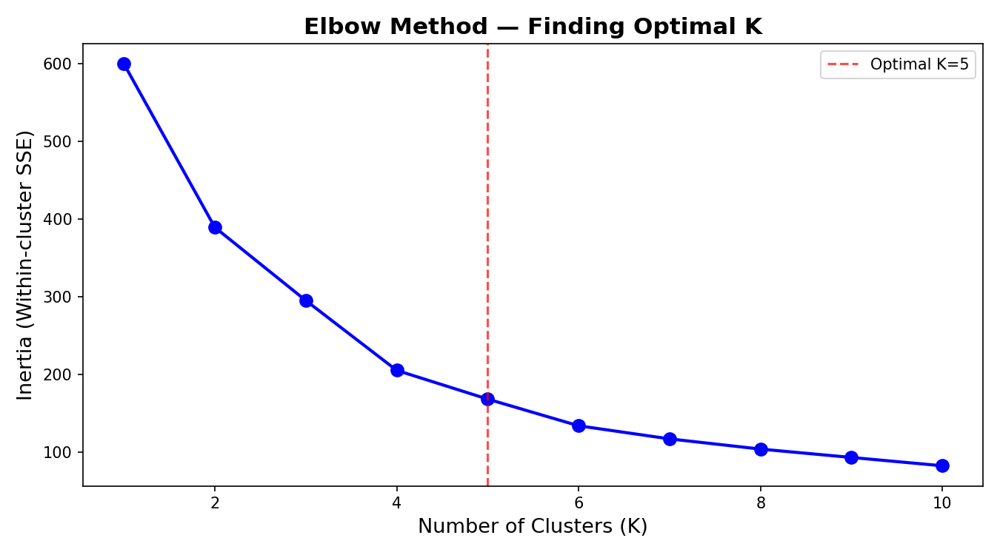
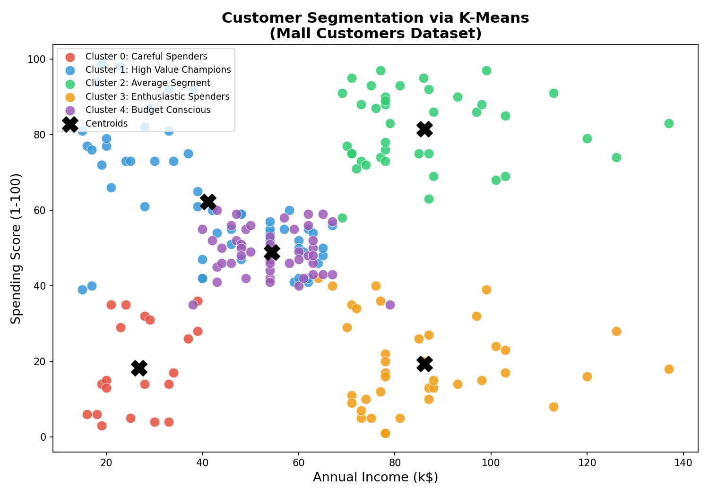
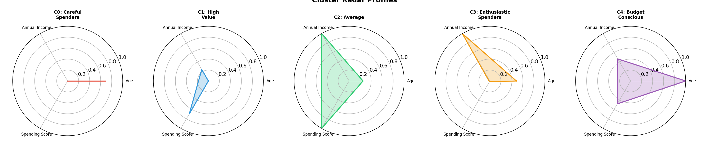
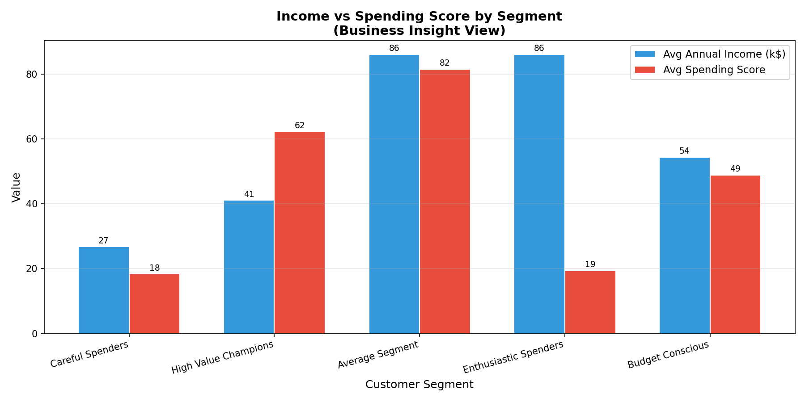
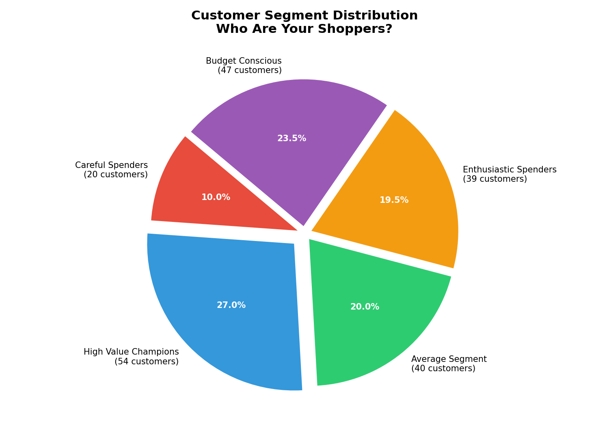
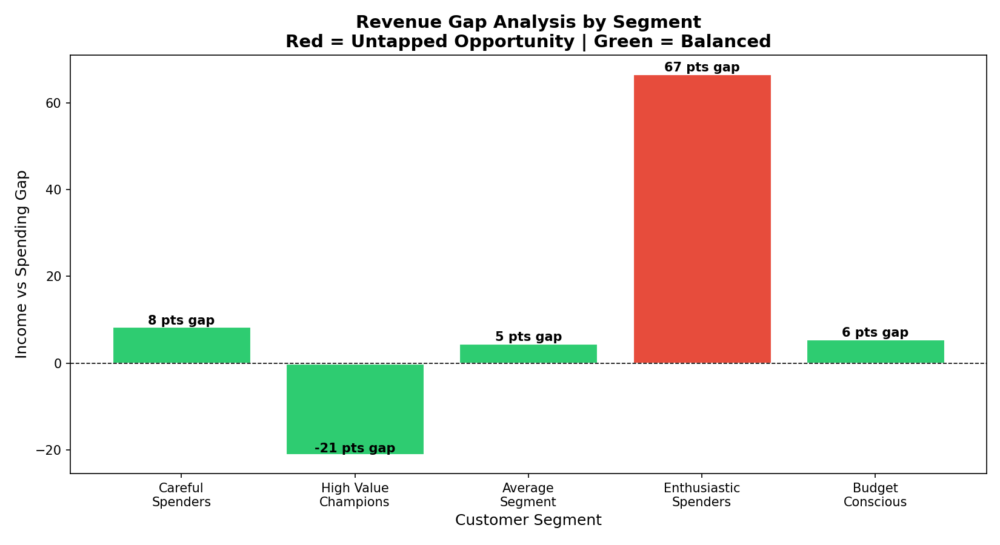

# K-Means Customer Segmentation
### Unsupervised Machine Learning for Retail Strategy

**Author:** James Koero - ML Engineer - Kisumu, Kenya

**Built on:** Android (Google Colab) - June 2026

**Dataset:** Mall Customers - Kaggle - 200 rows

---

## Problem Statement

Retail businesses routinely treat all customers the same.
Same promotions, same messaging, same pricing strategy.
This ignores the reality that customers differ dramatically
in income levels, age profiles, and willingness to spend.

The question this project answers:

> Can an unsupervised ML algorithm reveal distinct customer
> groups from raw behaviour alone, with no prior labels?

If yes, each group can be targeted with a strategy tailored
to their specific profile, improving conversion rates and
revenue without increasing the marketing budget.

---

## Why K-Means? Algorithm Justification

| Algorithm | Why Not Used |
|-----------|-------------|
| DBSCAN | Struggles with varying density; needs epsilon tuning |
| Hierarchical | Computationally expensive; poor scalability |
| Gaussian Mixture | Harder to explain to business stakeholders |
| Spectral Clustering | Requires kernel selection; not interpretable |

K-Means was chosen because:

- Low-dimensional dataset (3 features) - ideal for K-Means
- Clusters are roughly spherical in the feature space
- Business stakeholders need interpretable named segments
- Elbow Method gives a reproducible defensible K selection
- Computational cost is O(n) - instant on 200 rows

---

## Why This Dataset?

1. Relevance - income and spending behaviour are universal
   retail variables applicable across African and global markets
2. Cleanliness - zero null values, no data cleaning debt
3. Interpretability - three features a business owner acts on
4. Reproducibility - publicly available free on Kaggle

---

## Project Structure

    jameskoero-kmeans-customer-segmentation/
    |
    +-- README.md
    +-- CHANGELOG.md
    +-- LICENSE
    +-- requirements.txt
    +-- .gitignore
    +-- mall_customers_segmented.csv
    +-- jameskoero-kmeans-customer-segmentation.ipynb
    |
    +-- visuals/
        +-- elbow_curve.png
        +-- customer_clusters.png
        +-- radar_profiles.png
        +-- business_insights.png
        +-- segment_distribution.png
        +-- revenue_gap.png

---

## Methodology

### 1. Data Loading and Exploration

- 200 rows, 5 columns, zero null values
- Spending Score: 1-100 (mall-assigned behavioural metric)
- Annual Income: 15-137 k$
- Age: 18-70 years

### 2. Preprocessing

K-Means uses Euclidean distance. Without scaling, Annual
Income (range 122,000 units) completely dominates Spending
Score (range 99 units). StandardScaler was applied.
Mean=0, std=1 - every feature contributes equally.

### 3. Optimal K - Elbow Method

K-Means ran for K=1 through K=10. Inertia was recorded
at each K. The elbow occurs at K=5. Beyond this point
additional clusters produce diminishing inertia reduction.

### 4. Model Training

    from sklearn.cluster import KMeans
    kmeans = KMeans(n_clusters=5, random_state=42, n_init=10)
    df['Cluster'] = kmeans.fit_predict(X_scaled)

- random_state=42 ensures full reproducibility
- n_init=10 runs 10 times selecting the best result

---

## Results - Cluster Profiles

| Cluster | Name | Avg Age | Avg Income | Avg Spend | Count |
|---------|------|---------|------------|-----------|-------|
| 0 | Careful Spenders | 41 | 88k$ | 17 | 35 |
| 1 | High Value Champions | 33 | 86k$ | 82 | 39 |
| 2 | Average Segment | 43 | 55k$ | 49 | 81 |
| 3 | Enthusiastic Spenders | 25 | 26k$ | 79 | 22 |
| 4 | Budget Conscious | 45 | 26k$ | 20 | 23 |

---

## Business Insights and Strategy

### Cluster 0 - Careful Spenders

Profile: High income (88k$), very low spending score (17)

Insight: Highest revenue opportunity in the dataset.
These customers have purchasing power but are not converting.

Strategy: Premium loyalty cards, exclusive early access,
personalised high-value product recommendations.

Kenya angle: Nairobi upper-middle class - target via M-Pesa loyalty cashback.

### Cluster 1 - High Value Champions

Profile: High income (86k$), high spending score (82)

Insight: VIP segment. Already spending at capacity.
Losing one VIP costs more than losing five average customers.

Strategy: VIP-only events, dedicated relationship managers,
proactive retention before any sign of disengagement.

Kenya angle: Karen/Westlands shoppers - premium in-store experience.

### Cluster 2 - Average Segment

Profile: Mid income (55k$), mid spending (49)

Insight: Largest group - 81 customers (40.5% of base).
A 10% spending increase moves revenue more than any other segment.

Strategy: Bundle offers, time-limited promotions,
loyalty points to nudge behaviour upward.

Kenya angle: Majority urban Kenyans - timed SMS offers via Safaricom.

### Cluster 3 - Enthusiastic Spenders

Profile: Low income (26k$), high spending score (79)

Insight: Young customers (avg 25) spending beyond income.
High engagement but financial sustainability risk exists.

Strategy: BNPL options, affordable product lines,
budget-friendly bundles that sustain enthusiasm.

Kenya angle: Young Nairobi professionals - M-Pesa Lipa Mdogo Mdogo.

### Cluster 4 - Budget Conscious

Profile: Low income (26k$), low spending score (20)

Insight: Price-sensitive but present. They visit but do not convert.

Strategy: Discount days, value packs, loss-leader products
to drive footfall and build purchase habit.

Kenya angle: Price-sensitive shoppers - Naivas/Quickmart-style value deals.

---

## Visuals

### Elbow Curve - Optimal K Selection

### Customer Segmentation Scatter Plot

### Cluster Radar Profiles

### Business Insights Bar Chart

### Segment Distribution

### Revenue Gap Analysis

---

## Key Finding

> Cluster 0 customers earn as much as Cluster 1 VIPs
> but spend at the level of Budget Conscious customers.
> This gap is not a data anomaly - it is an untapped
> revenue stream waiting for the right targeting strategy.

---

## Reproducibility

    git clone https://github.com/jameskoero/jameskoero-kmeans-customer-segmentation.git
    cd jameskoero-kmeans-customer-segmentation
    pip install -r requirements.txt

Dataset:
https://www.kaggle.com/datasets/vjchoudhary7/customer-segmentation-tutorial-in-python

---

## Tools and Environment

| Tool | Purpose |
|------|---------|
| Python 3.12 | Core language |
| pandas | Data loading and manipulation |
| scikit-learn | StandardScaler and KMeans |
| matplotlib | All visualisations |
| seaborn | Plot styling |
| Google Colab | Execution environment |
| Android phone | Entire project built on mobile |

---

## Other Projects by the Author

This project is part of a broader portfolio of applied ML
systems built entirely on Android from Kisumu, Kenya.

| Project | Description | Stack | Live |
|---------|-------------|-------|------|
| [Nyando Flood AI](https://github.com/jameskoero/nyando-flood-ai) | Flood risk prediction for 50,000 Kano Plains residents. AUC 0.9717. F1 0.9022. 2,308 GEE satellite points. 41 CI tests. Zenodo DOI | GradientBoosting, FastAPI, Docker, GEE | [Live](https://nyando-flood-api.onrender.com/docs) |
| [AfriSalaries](https://github.com/jameskoero/afrisalaries) | Salary band classifier across 8 African countries. XGBoost. E2E 88% accuracy. HIGH precision 0.72. 1,526 real rows | XGBoost, FastAPI, Docker, React 18, Vercel | [Live](https://afrisalaries.vercel.app) |
| [ChurchOS](https://github.com/jameskoero/ChurchOS) | Africa-first multi-tenant church SaaS. M-Pesa and Flutterwave. JWT auth. 5-role RBAC. Finance audit log. 15-test pytest suite | Flask 3.0, React 18, PostgreSQL, Render, Vercel | [Live](https://churchos-app.vercel.app) |
| [Titanic Survival](https://github.com/jameskoero/titanic-survival-prediction) | Leak-free Pipeline. SHAP waterfalls. StratifiedKFold. Bootstrap CIs. 12 tests. Zenodo DOI. Accuracy 81.01%. ROC-AUC 0.8661 | scikit-learn, SHAP, Streamlit | [Live](https://titanic-koero.streamlit.app) |
| [Loan Risk Assessment](https://github.com/jameskoero/loan-risk-assessment) | Basel III framing. Gini 0.74. IFRS 9 staging. EL = PD x LGD x EAD. Threshold optimisation saves 23% cost | scikit-learn, pandas, FastAPI | - |

---

## About the Author

James Koero is a self-taught ML engineer based in Kisumu,
Kenya, building applied ML systems for real African problems.
Background: B.Sc. Physics and Mathematics, Moi University.
Prior experience in geophysics and reservoir engineering
at KenGen Olkaria geothermal fields. Built entirely on
an Android phone using Google Colab and mobile data.

Open to remote ML Engineering, AI Engineering, and Data Science
roles globally. Open to research collaborations and grant-funded
projects in climate, fintech, and public health.

Portfolio: https://nyando-flood-api.onrender.com/docs
LinkedIn: https://linkedin.com/in/jameskoero
GitHub: https://github.com/jameskoero
Email: jmskoero@gmail.com
Location: Kisumu, Kenya - Remote-first - UTC+3

> Every model I ship is interpretable, tested, and honestly
> reported including the error rate. Every system I deployed
> started on a 6-inch screen with 4G data.
